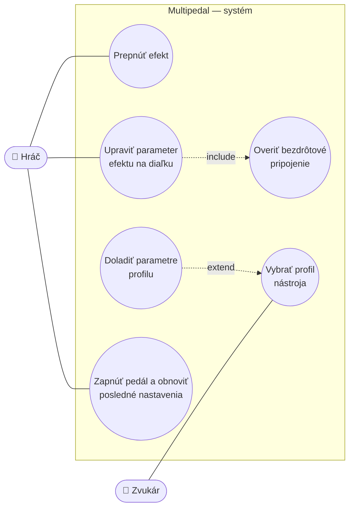
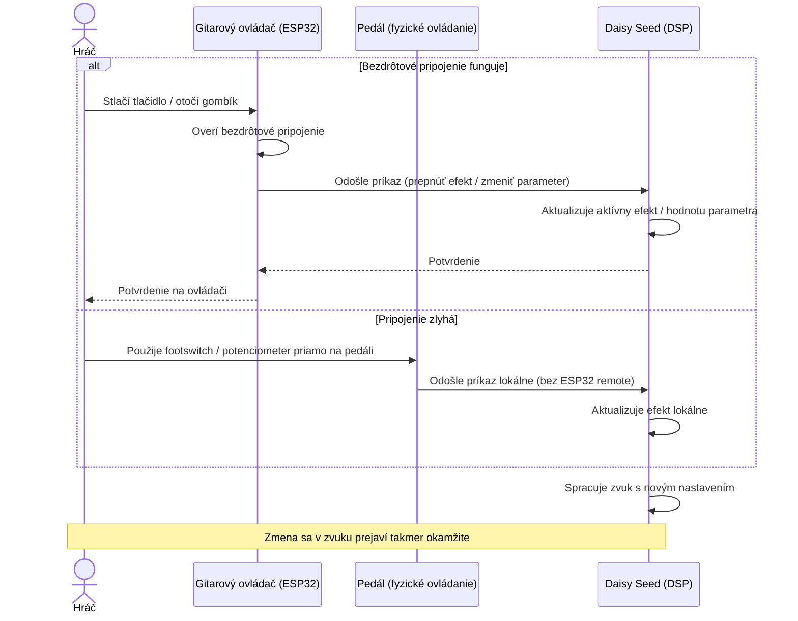
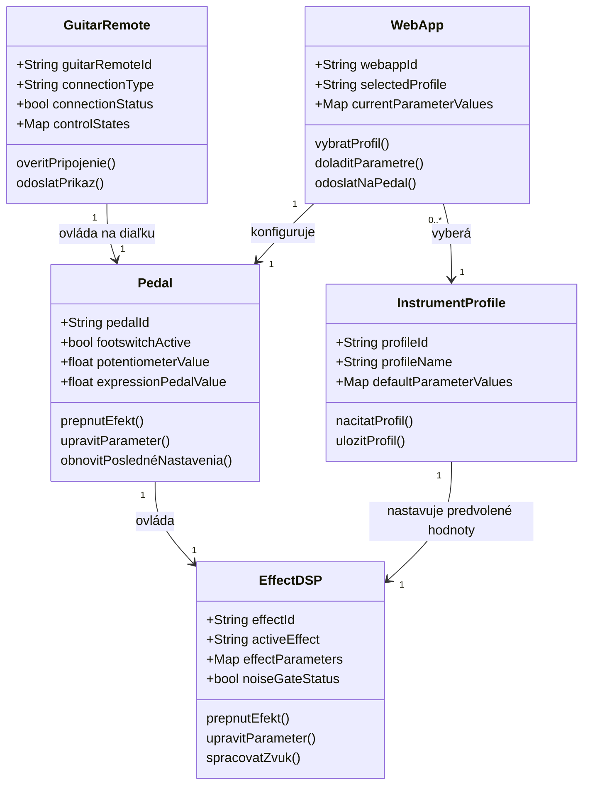

# Efektový DSP Multipedal (Filip Rechtorík)
- **Názov projektu**: Efektový DSP Multipedal
- **Meno riešiteľa**: Filip Rechtorík

---

## Dôvod a okolnosti zavedenia riešenia
Klasický gitarový pedalboard so samostatnými efektovými pedálmi prináša viacero praktických nevýhod — zložitú kabeláž, potrebu vlastného napájania pre každý pedál a nutnosť počas vystúpenia opakovane sa skláňať a prepínať jednotlivé efekty nohou. Cieľom projektu je tieto nevýhody odstrániť spojením viacerých efektov do jedného DSP pedála, ktorý zároveň umožňuje meniť ich parametre na diaľku — priamo z gitary alebo z telefónu. Hráč tak získa väčšie pohodlie a rýchlejší prístup k nastaveniam počas hrania, bez zbytočného fyzického zaťaženia.

---

## Slovné zadanie, popis projektu od zákazníka
Pedál využíva viacero známych gitarových efektov — Wah, Pitch Shift a tretí efekt (výber zatiaľ nie je finálny) — spolu s noise gate, čím dosahuje takmer profesionálnu úroveň spracovania zvuku. Spracovanie zvuku zabezpečuje DSP (Digital Signal Processing) realizované pomocou Daisy Seed. Pedál sa ovláda otočnými potenciometrami a footswitchmi na výber efektu a úpravu jeho intenzity, ktoré je možné ovládať aj na diaľku pomocou ovládača pripevneného priamo na gitare — ten slúži na rýchle zásahy počas samotného hrania. Pre rozšírenejšie použitie je určená webová aplikácia, ktorá umožňuje vybrať profil pre rôzne typy elektrických gitár a ponúka tak podrobnejšie nastavenie parametrov mimo samotného vystúpenia.

---

## Zoznam modulov projektu a ich významných atribútov
1. **Fyzický pedál**
   - Atribúty: stav footswitchov (aktívny efekt), poloha potenciometrov/expression pedálu
   - Unikátna identifikácia objektov: pedal.id

2. **Guitar Mounted Remote**
   - Atribúty: typ pripojenia (Bluetooth), stav pripojenia, stav ovládacích prvkov (gombíky)
   - Unikátna identifikácia objektov: guitarRemote.id

3. **Webová aplikácia (UI)**
   - Atribúty: vybraný profil nástroja, aktuálne zobrazené hodnoty parametrov
   - Unikátna identifikácia objektov: webapp.id

4. **DSP / efektový modul**
   - Atribúty: aktívny efekt, hodnoty parametrov efektu, stav noise gate
   - Unikátna identifikácia objektov: effect.id

5. **Profily nástrojov**
   - Atribúty: názov profilu (typ gitary/basy), predvolené hodnoty parametrov pre daný profil
   - Unikátna identifikácia objektov: profile.id

---

## Systémové požiadavky FURPS
1. **Funkčnosť (Functionality - F)**
   - Úprava zvuku z gitary pomocou DSP
   - Prepínanie efektov pomocou vzdialených rozhraní
   - Nastavenie intenzity (parametrov) jednotlivých efektov

2. **Vhodnosť k použitiu (Usability - U)**
   - Jednoduché používanie — hráč sa nemusí fyzicky skláňať k pedálu
   - Digitálne rozhranie navyše umožňuje pokročilejšie nastavenie parametrov

3. **Spoľahlivosť (Reliability - R)**
   - Pedál funguje ako samostatná jednotka nezávislá od vzdialených rozhraní — výpadok bluetooth spojenia hru      neovplyvní, pedál naďalej hrá na posledných platných nastaveniach

4. **Výkon (Performance - P)**
   - Oneskorenie spracovania je minimálne a pre ľudské vnímanie prakticky zanedbateľné

5. **Schopnosť údržby (Supportability - S)**
   - Pridanie nového efektu vyžaduje úpravu zdrojového kódu DSP zariadenia
   - Vzdialené rozhrania (remote) je možné pridávať aj odoberať bez zásahu do zvyšku systému — úpravy prebiehajú na DSP mikrokontroléri a komunikačnom mikrokontroléri (ESP32) nezávisle od seba

---

## Kritické situácie
1. **Systémové**
   - Výpadok napájania
   - Mechanická porucha hardvéru
   - Nesprávne prispôsobená vstupná impedancia (spôsobí skreslenie alebo stratu signálu z gitary)

2. **Aplikačné**
   - Zlyhanie komunikácie medzi ESP32 modulmi navzájom alebo medzi zariadením (gitarový ovládač/telefón) a ESP32

---

## Tri situácie definujúce hranice systému
1. **Ideálny scenár**
   - Hráč plynulo prepína efekty a mení parametre cez všetky rozhrania bez problémov.

2. **Hranične riešiteľný scenár**
   - Hráč stratí možnosť ovládať efekty na diaľku (výpadok komunikácie s gitarovým ovládačom alebo webovou appkou), no dokáže pokračovať priamo cez fyzické ovládacie prvky na pedáli — footswitche a potenciometre.

3. **Situácie, ktoré systém nezvládne**
   - Poškodenie alebo výpadok DSP mikrokontroléra — bez neho nie je možné spracovanie zvuku ani fungovanie efektov, pedál sa stáva nefunkčným.

---

## Kontext prostredia
Pedál je samostatná jednotka, ktorá nie je závislá od iných existujúcich systémov. Vzhľadom na povahu projektu (prenosné zariadenie používané naživo) je odolný voči väčšine bežných nárazov, poškodiť ho môžu len extrémne teploty alebo hrubé mechanické zaobchádzanie. Používa sa na pódiách, doma aj v skúšobniach, kde sa teplota a vlhkosť môžu líšiť, no v rozsahu, ktorý funkčnosť pedála neovplyvňuje.

---

## Charakteristika aktérov a prostredia
- **Aktéri**: Hráč, Zvukár
- **Prostredie**: Skúšobňa, pódium, webová aplikácia, bezdrôtový ovládač na gitare, fyzické rozhranie pedála

---

## Use Case diagram

---

## Scenáre - konkrétna implementácia Use Case

**1. Hráč prepína efekt a upravuje parameter naživo počas hrania**  
   - **Názov**: Prepnutie efektu a úprava parametra počas vystúpenia 
   - **Kontext**: Hráč potrebuje počas hrania rýchlo zmeniť aktívny efekt alebo doladiť jeho intenzitu bez prerušenia hry
   - **Level zanoření Use Case**: Hlavný scénar  
   - **Aktéri**: Hráč 
   - **Stakeholdeři a zájmové osoby**: Hráč, ostatní členovia kapely, publikum 
   - **Vstupné podmienky**: Pedál je zapnutý a napájaný, hráč má gitaru pripojenú k pedálu
   - **Výstupné podmienky**: Zvolený efekt je aktívny s nastavenou intenzitou
   - **Minimálny výstup**: Efekt sa prepne / parameter sa zmení, aj keď s miernym oneskorením
   - **Ideálny výstup**: Zmena sa prejaví v zvuku takmer okamžite, bez počuteľného zásahu do hry

**Hlavný scénár**:  
1. Hráč stlačí footswitch na pedáli alebo tlačidlo na gitarovom ovládači.
2. Signál sa spracuje priamo na pedáli / prenesie cez ESP32 na Daisy Seed.
3. DSP modul prepne aktívny efekt alebo upraví jeho parameter.
4. Zmena sa okamžite prejaví vo výstupnom zvuku.

**Rozšírenie**:  
- Ak zlyhá bezdrôtové spojenie gitarového ovládača, hráč pokračuje priamo cez footswitche a potenciometre na fyzickom pedáli — pedál funguje ako samostatná jednotka nezávisle od diaľkového ovládania.

**2. Zvukár nastaví profil nástroja pred vystúpením**  
   - **Názov**: Kalibrácia a výber profilu nástroja pred vystúpením 
   - **Kontext**: Zvukár pred vystúpením potrebuje nastaviť pedál pre konkrétny nástroj (napr. typ gitary) a doladiť parametre podrobnejšie, než to dovoľuje rýchle ovládanie počas hry
   - **Level zanoření Use Case**: Hlavný scenár
   - **Aktéri**: Zvukár
   - **Stakeholdeři a zájmové osoby**: Hráč, kapela
   - **Vstupné podmienky**: Pedál je zapnutý, webová aplikácia je pripojená k pedálu
   - **Výstupné podmienky**: Pedál beží s parametrami nastavenými podľa zvoleného profilu nástroja
   - **Minimálny výstup**: Profil sa vyberie a parametre sa nastavia
   - **Ideálny výstup**: Zvukár si profil podľa potreby ešte doladí a nastavenie sa uloží pre ďalšie použitie

**Hlavný scénár**:  
1. Zvukár otvorí webovú aplikáciu a pripojí sa k pedálu.
2. Vyberie profil zodpovedajúci danému nástroju.
3. Aplikácia odošle predvolené hodnoty parametrov profilu na pedál.
4. Zvukár prípadne parametre ručne doladí cez rozhranie aplikácie.
5. Nastavenie sa uloží ako aktívny profil pedála

**Rozšírenie**:  
- Ak sa počas nastavovania preruší spojenie s appkou, pedál zostáva na poslednom uloženom profile a zvukár môže pokračovať priamo cez fyzické ovládacie prvky na pedáli.

---

## Sekvenčný diagram

---

## Triedny diagram

---
